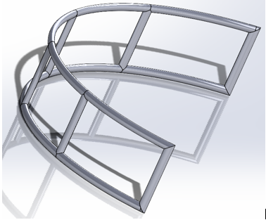
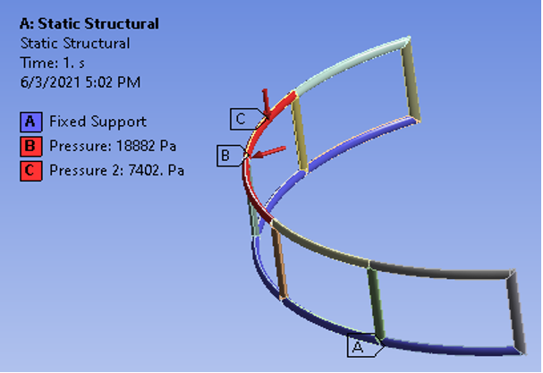
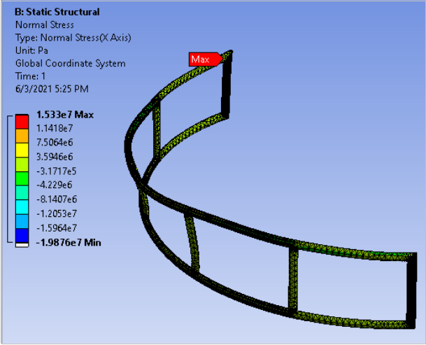
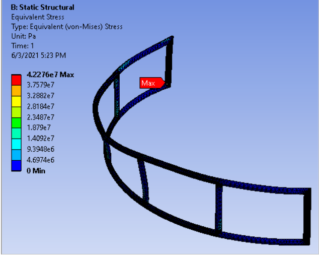
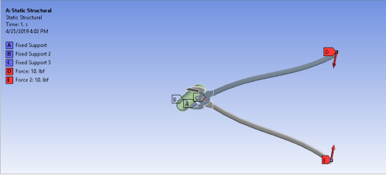
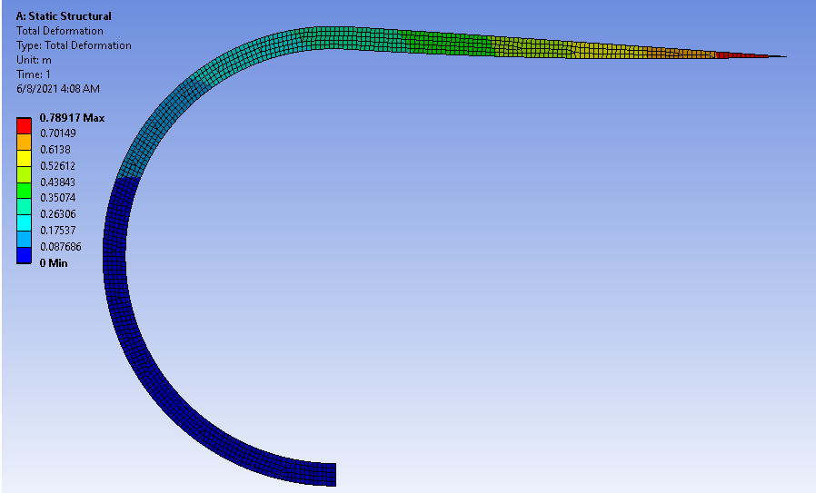

## Roller Coaster Support Structure Design

The objective of this project is to design and test the structure of the support of a roller coaster track under various loading conditions. We implement a truss structure as the support of the track and test the structure in three different scenarios. We then compare the FEA results from Ansys with analytical results of buckling load and yield strength of the material to decide whether the design is feasible.

The above graph is the CAD of the structure which is generated in the Solidworks.

We generalize the situation when the cart is making a banked turn. As the cart makes the turn, the centripetal acceleration contributes to the bending of the structure, the weight of the cart contributes to the buckling. The centripetal acceleration will be modeled as a static transverse load at the tip of the beam. Assume the linear velocity of the cart at the curve is 10 m/s, slower than the speed at which the cart reaches the bottom of the track. The design should have stresses within the yield strength of the material/FOS, as well as normal stress within the buckling limit.

In this situation, the cart is making a banked turn at a slower velocity. The distance between the truss members is set to 10m. The lower end of the beams is pinned on the ground. The radius of the curve the cart is making is 4m. We assume the weight is uniformly distributed on the top, whereas the centripetal acceleration is a concentrated transverse force at the tip of the beam. Assume the linear velocity of the cart is at 10 m/s, lower than the speed at which the cart reaches the lowest of the track from scenario 1. The normal pressure is 7402Pa, distributed over the length of the cart. The bending force at the tip is 18882 Pa.

Based on this result, the maximum normal stress is 15.33 MPa, which is smaller than the maximum buckling stress of 311 MPa. That means this design satisfies buckling.

Based on this result, the maximum equivalent stress is 42.28 MPa. The yield stress of steel is 420MPa. If we assume the safety of factor is 6, then the maximum yield stress is 70 MPa. Our design is smaller than this value. That means it satisfies the yield limit.

## Cutting tool Design

We designed the cutting tool (below) according to requirements. The significant constraint is to produce 100 lbf force by applying 10 lbf force on both arms. So, we designed the length based on the lever principle. At the same time, we need to ensure a 15° angle between the jaws when a 1-inch (diameter) pipe is located between these.

In order to generate the 15 degrees between the jaws, we need to add the 10 force on both ends of the arms. Then, the fixed support will be adding on the edge of a pin so that the whole cutting tool cannot be moved on the z-axis. Afterward, we will add fixed support on the edge of the inner ring to prevent the sliding of the pipe. Finally, we added fixed support on the edge of the blade point. Then we can obtain the magnitude of the force applying on the pipe by the force reaction

The below graph is the result. In this result, the maximum equivalent stress is 27140 psi, which is 187.13 MPa. Since the material is chosen as the steel and the yield stress of steel is 420MPa, it can satisfy the yield limit. The total force turns out 153.09lbf which is beyond 100 lbf on the edges. So, this design can satisfy the requirement.

This is the cutting tool generated by the 3D print.

## Sculpture Design

In this design, the sculpture consists of a circular section of inner radius 9.5m, outer radius 10.5, and a straight segment of length 19.5m. By using a type of carbon fiber composite material with 1750 𝑘𝑔/𝑚3 density, 3e11 Young’s modulus, and 0.1 Poisson’s ratio, the maximum deformation is only 0.8258 m.