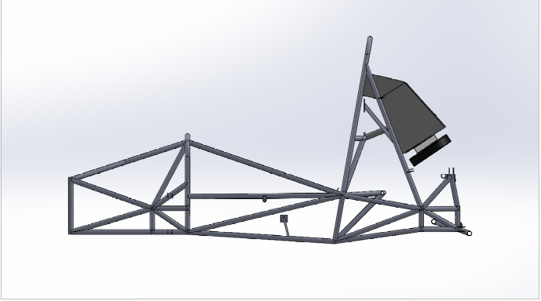
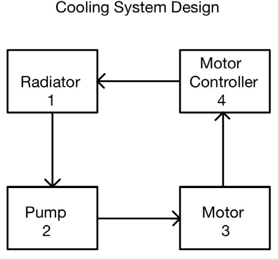
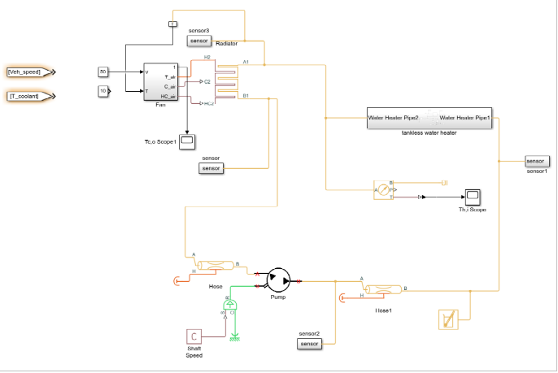
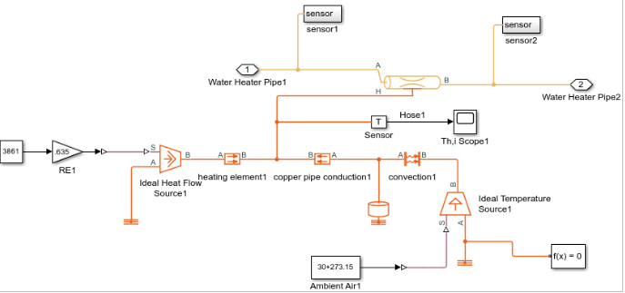

## Abstarct

**🔗 [View News at Florida Tech](https://news.fit.edu/engineering/5-student-design-projects-prepping-seniors-for-a-career-in-computer-engineering-and-sciences/)**

SAE Formula Electric is the second year of a continuation project aimed at establishing an SAE electric vehicle at Florida Tech. The project carries on the designs of the accumulator and high voltage testbed from last year’s Formula Electric teams. Additionally, through a combined effort of three electrical and one mechanical team, this team designed, tested, and produced three additional systems: high voltage box, low voltage box, and cooling system. The goal was to integrate and mount the accumulator, motor controller, motor, high voltage box, low voltage box, and cooling system with the limited user interface on the chassis.

## Cooling System Design

As a second-year student design project, SAE Formula Electric aimed to build upon the creation of a Florida Tech electric vehicle to eventually compete in the Formula SAE (formerly Society of Automotive Engineers) student competition. A combination of three electrical teams and one mechanical team, the project carried over the accumulator and high-voltage test-bed designs from last year and worked to produce a high-voltage box, low-voltage box, user interface and cooling system.

The biggest challenges the teams faced were due to design restrictions and subsystems’ integration dependency, as well as meeting SAE requirements, high-voltage restrictions and thermal design. Some unforeseen safety hazards arose as members worked their way through the project, too.

“The accumulator design did not provide capability for maintenance and repair; therefore, the team decided to disassemble the accumulator to mitigate safety hazards. The disassembly of the accumulator affected all of the subteams because it prevented the use of the motor controller and motor, and subsequently, the integration of all the subsystems. The test plan was modified to overcome the complications.”

This year’s team already has some ideas for how next year’s members can improve the project going forward.

Learn more!

Team Members

Tomas Lavigne (team lead), Bader Taher, Abdulla Alsereidi, Abdullah Alsharif, Kuron Seabrun, Jeff Walker, Humaid Al Zarai, Abdullah Al Bulushi, Thomas Gribben, Xianoho Wang, Julanda Al Shukaili, Pijuan Yu, Khaleifah Alyammahi, Nicolas Irurita, Duwan Equez, Ziyuan Wan

Faculty Advisor

Kenneth Gibbs, adjunct instructor, computer engineering and sciences

The cooling system components support the safety and reliability of the car by ensuring the motor and motor controller maintain operating temperatures. The cooling system comprises a radiator, fan shroud, electric fan, and water pump. The radiator is a heat exchanger between the hot coolant flowing through the system and the surrounding. The electric fan and shroud increase airflow through the radiator which provides more efficient heat transfer. The water pump regulates the fluid pressure and maintains a steady flow rate of 8 liters per minute within the system.

The block diagram above shows the continuous flow of coolant through the system. The pump pushes the coolant through the motor and motor controller. As the coolant runs through the motor and motor controller, it absorbs thermal energy due to the temperature gradient. The heated coolant then runs through the radiator. The radiator reduces the thermal energy in the system by transferring the heat into the air. The radiator’s heat exchange rate is crucial to match the propulsion system’s continuous thermal energy productions. The radiator was chosen based on thermal system design calculations for the desired temperatures and heat exchange effectiveness.

## Simulation in simulink

This is a simulation to verify our calculations. MATLAB and Simulink were used to perform the simulations. The setup, seen in the below graph, includes the fan, water pump, radiator, hoses, and tankless water heater. There are three cycles in this system: water cycle, airflow cycle, and heat flow cycle. In Simulink, the yellow line is the water cycle; the purple line is the airflow rate; the orange line is the heat flow cycle. 

The simulation results can be seen in the above graph. The temperature of the input heat water increases logarithmically till it approaches a steady state after 300 s with a value of 56.92 C. The temperature of the output cool water decreases exponentially till it reaches a steady state after 50 s at 33.79 C.