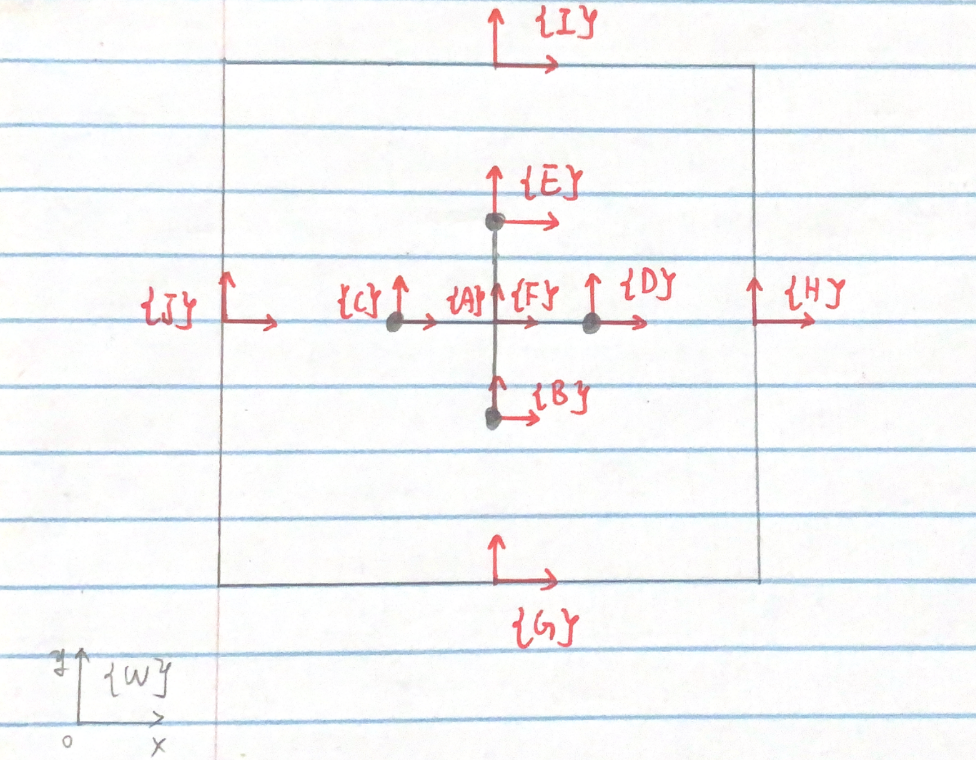

## Simulation Results



## Project Overview

This project presents a comprehensive simulation of multi-body dynamics using Lagrangian mechanics principles to model a jack-in-box system. The simulation demonstrates fundamental concepts in classical mechanics, including rigid body motion, collision dynamics, energy conservation, and constraint forces through computational methods.

**🔗 [View Source Code on GitHub](https://github.com/pijuanyu/jackbox)**

## Theoretical Foundation

### Lagrangian Formulation

The system dynamics are governed by the Euler-Lagrange equations:


$$
\frac{d}{dt}\left(\frac{\partial L}{\partial \dot{q}}\right) - \frac{\partial L}{\partial q} = Q
$$


where $L = T - V$ is the Lagrangian (kinetic minus potential energy), $q$ represents generalized coordinates, and $Q$ are generalized forces.

### Kinetic Energy Formulation

The total kinetic energy of the system is expressed as:


$$
KE = \frac{1}{2}(v^b)^T \begin{bmatrix} m I_{4x4} & 0 \\ 0 & I \end{bmatrix} v^b
$$


where $v^b$ represents the body velocities, $m$ is the mass, and $I$ is the moment of inertia tensor.

## System Description

### Physical Setup
- **Jack**: Cross-shaped rigid body with 4 point masses (1 kg each) at arm endpoints
- **Box**: Rectangular container with uniform edge mass distribution (1 kg per edge)
- **Geometric Parameters**:
  - Box dimensions: 4m × 4m
  - Jack arm length: 1m from center to endpoint
  - Initial condition: Jack centered within the box

### Coordinate Systems
1. **World Frame {W}**: Inertial reference frame
2. **Jack Frame {A}**: Body-fixed frame at jack's center of mass
3. **Box Frame {F}**: Body-fixed frame at box's geometric center



## Mathematical Modeling

### Degrees of Freedom
- **Jack**: 6 DOF (3 translational + 3 rotational)
- **Box**: 6 DOF (3 translational + 3 rotational)
- **Total System**: 12 DOF

### Applied Forces
- **Horizontal driving force**: $F_x = 0.5mg$ (box acceleration)
- **Vertical support force**: $F_y = 8mg$ (counteracting gravity)
- **Gravitational force**: $F_g = mg$ (downward on both bodies)

### Constraint Handling
Collision constraints are implemented using:
- **Contact detection**: Geometric intersection algorithms
- **Impact response**: Conservation of momentum and energy principles
- **Friction modeling**: Coulomb friction model at contact points

### Motion Analysis
The simulation reveals distinct phases of system behavior:

1. **Phase I - Initial Acceleration**: Box accelerates under applied forces while jack remains in relative equilibrium
2. **Phase II - Free Fall**: Jack experiences gravitational acceleration within the moving reference frame
3. **Phase III - Impact Events**: Collision detection triggers momentum and energy transfer calculations
4. **Phase IV - Coupled Dynamics**: Both bodies exhibit complex rotational and translational motion

### Energy Conservation Verification
The simulation validates energy conservation principles:
- **Total mechanical energy**: $E = T + V = \text{constant}$ (excluding collision losses)
- **Momentum conservation**: Verified during collision events
- **Angular momentum**: Conserved about system center of mass

## Numerical Implementation

### Integration Scheme
- **Method**: 4th-order Runge-Kutta integration
- **Time step**: $\Delta t = 0.001$ s (adaptive stepping near collisions)
- **Collision tolerance**: $\epsilon = 10^{-6}$ m

### Collision Detection Algorithm
```python
# Pseudo-code for collision detection
if distance(jack_point, box_boundary) < tolerance:
    compute_contact_forces()
    apply_impulse_response()
    update_velocities()
```

### Validation Methods
- **Energy drift monitoring**: Total energy variation < 0.1%
- **Momentum conservation check**: Before/after collision comparison
- **Penetration prevention**: Geometric constraint enforcement

## Engineering Applications

This simulation framework demonstrates principles relevant to:

### Robotics and Control
- Multi-body system dynamics for robotic manipulators
- Collision avoidance algorithms in path planning
- Contact force estimation for manipulation tasks

### Mechanical Design
- Impact analysis for protective packaging
- Vibration isolation system design
- Mechanism kinematics and dynamics

### Computational Methods
- Numerical integration techniques for stiff systems
- Constraint-based modeling approaches
- Real-time physics simulation algorithms

## Technical Implementation

### Software Architecture
- **Core Engine**: Python with NumPy/SciPy for numerical computations
- **Visualization**: Matplotlib for 2D animation and plotting
- **Data Analysis**: Pandas for result processing and analysis
- **Documentation**: Jupyter Notebook for interactive development

### Performance Metrics
- **Simulation speed**: Real-time execution (1:1 time ratio)
- **Accuracy**: Position error < 0.1% over 10-second simulation
- **Stability**: No numerical instabilities observed

## Conclusions and Future Work

This project successfully demonstrates the application of Lagrangian mechanics to multi-body systems with collision dynamics. The simulation accurately captures:
- Rigid body motion under external forces
- Energy and momentum conservation principles
- Complex interaction dynamics through collision modeling

### Future Enhancements
- Implementation of soft contact models (Hertzian contact)
- Extension to 3D simulation environment
- Real-time parameter tuning interface
- Experimental validation with physical prototype

---

*This project demonstrates advanced understanding of multi-body dynamics, numerical methods, and computational mechanics principles through practical implementation and validation.*
