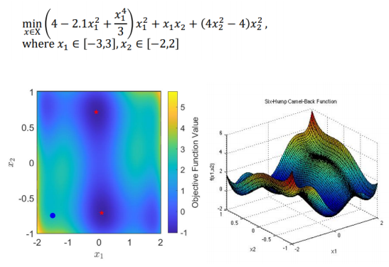
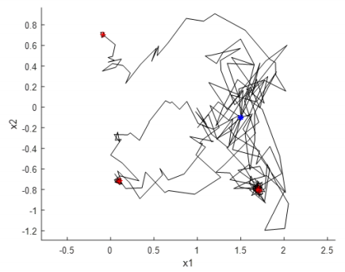
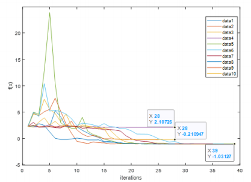
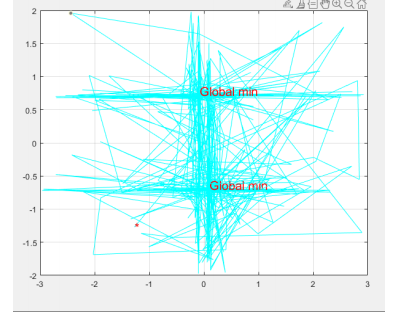
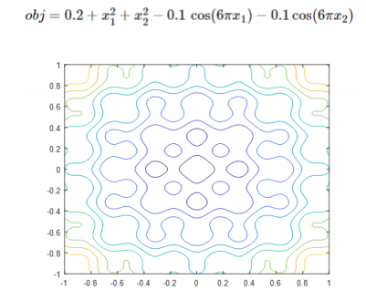
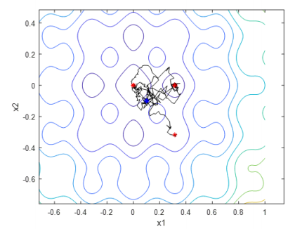
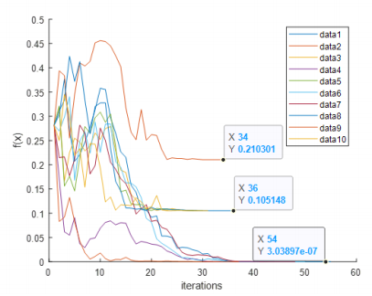

## Project overview

Simulated annealing is a stochastic technique for searching the global optimum of a given function. This approach can deal with highly nonlinear functions with many constraints. The most important advantage of this algorithm is that it can avoid finding the local minimum solution through probabilistic decisions. Besides, this technique is very versatile for almost all functions. So, we decided to build a generalized code for this algorithm in MATLAB and try to analyze this approach through several tests.

The primary objective of this project is to make sure our algorithm can find the optimal solution for every test from our several nonlinear functions. We will measure our algorithm in terms of robustness, efficiency, and accuracy. And the result of our algorithm will be compared with the iSight so that we can find the defect of our algorithm and try to improve it.

## Six-hump Camel function

The first example is the six-hump Camel function. The reason why we choose this function is that there are six local minimum solutions and two global minimum solutions. We expected our algorithm to find out these two global minimum solutions (two red points in the left graph) and avoid becoming trapped in these six local solutions.

### Result from our algorithm

The plot above shows the result of our MATLAB implementation of the problem at (1.5, -0.1). In these 10 tests, there are 6 trails that approached the global optimum solution. Each trail takes about 40 iterations. The reason causing this is that the temperature profile and the step size we choose, make a worse state less likely to be accepted as iteration increases so that the result can be converted quickly and stabilized. This is a tradeoff between efficiency and accuracy.

### Result from iSight (the standard solution)

Compared with the MATLAB result, the iSight result is much more accurate. It can always produce the optimal solutions no matter how many times we test it. And this 15 iSight method can still accept a high energy state at the end of the iterations. That means it can still be capable of getting the other optimal solutions in the end. By contrast, the temperature profile in our approach eventually becomes zero, which means the probability P decreases to zero and it cannot accept a higher energy state anymore. However, our MATLAB technique takes fewer iterations. The iSight technique usually takes around 700 iterations and our approach only takes approximately 60 iterations. That means our approach has higher efficiency, even though it has lower accuracy.

## Non-Convex Function Example

The second function we tested has one global optimum in the middle but is surrounded by multiple local optimum, which increase the difficulties of the algorithm searching for a global optimization.

There are many local minimums surrendered at the global optimum point, as a result, 5 out of 5 runs were able to get to the global optimum. The temperature profile was set to a constant decay factor for faster iterations. A way to improve the result could be increasing the step size and adjusting the temperature profile, or running the solver ten times and selecting the most optimized result.