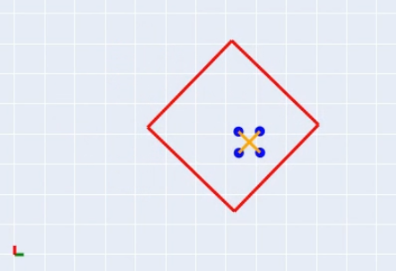

## Overview

The **Jackbox** project is a comprehensive multi-body dynamics simulation implemented in Python that demonstrates complex interactions between rigid bodies under external forces. This simulation models a jack (cross-shaped object) bouncing inside a moving box, showcasing realistic physics including gravity, collision detection, energy transfer, and rotational dynamics.

**🔗 [View Source Code on GitHub](https://github.com/pijuanyu/jackbox)**

## Technical Implementation

### System Dynamics
The simulation employs fundamental principles of classical mechanics to model:
- **Rigid body motion** with 6 degrees of freedom per object
- **Collision detection and response** between the jack and box boundaries
- **Energy conservation** during elastic collisions
- **Rotational dynamics** including angular momentum transfer
- **External force application** for controlled motion

### Physical Parameters
- **Mass distribution**: Each point mass of the jack = 1 kg, each edge of the box = 1 kg
- **Geometric constraints**: Box edge length = 4 m, jack arm length = 1 m
- **Applied forces**:
  - Horizontal driving force: 0.5mg (x-direction)
  - Vertical supporting force: 8mg (y-direction)
  - Gravitational acceleration: g = 9.81 m/s²

## Coordinate Systems

The simulation employs three primary reference frames:
- **World Frame {W}**: Global coordinate system for absolute positioning
- **Jack Frame {A}**: Local coordinate system centered at the jack's centroid
- **Box Frame {F}**: Local coordinate system centered at the box's geometric center

*Initial condition*: Frames {A} and {F} are coincident with the jack positioned at the box center.

## Simulation Results



The physics simulation demonstrates several key behavioral phases:

1. **Initial Motion**: The box accelerates upward and rightward due to applied external forces
2. **Free Fall**: The jack enters gravitational free fall within the moving reference frame
3. **Primary Impact**: Jack collides with the box bottom, transferring momentum and inducing rotation
4. **Secondary Collisions**: Multiple bounce events with diminishing energy
5. **Coupled Motion**: Both bodies achieve synchronized translational and rotational motion

### Key Observations
- **Energy Transfer**: Kinetic energy exchanges between translational and rotational modes during collisions
- **System Stability**: External forces maintain bounded motion preventing system escape
- **Realistic Physics**: Collision responses follow conservation of momentum and energy principles

## Applications

This simulation framework demonstrates concepts applicable to:
- **Robotics**: Multi-body system control and collision avoidance
- **Mechanical Engineering**: Impact analysis and vibration damping
- **Game Physics**: Realistic object interactions in virtual environments
- **Educational Tools**: Visual demonstration of classical mechanics principles

## Technical Stack

- **Language**: Python 3.x
- **Visualization**: Matplotlib for animation and plotting
- **Numerical Methods**: NumPy for efficient array operations
- **Development Environment**: Jupyter Notebook for interactive development
- **Documentation**: Markdown for technical specification

---

*This project showcases computational mechanics skills and demonstrates proficiency in physics-based simulation development.*
