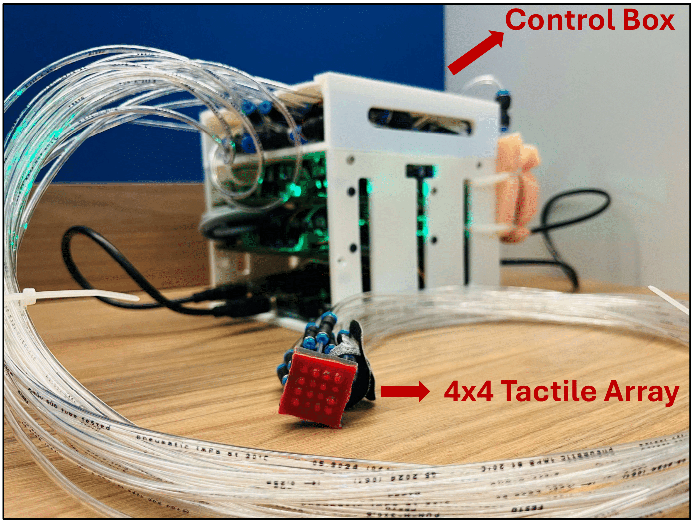

## Demonstration



This work is published in [2025 IEEE 22nd International Conference on Ubiquitous Robots (UR)](https://doi.org/10.1109/UR65550.2025.11078133).

## Project Overview

This study presented a soft haptic display toolkit. It provides a rapid prototyping approach and real-time wireless control for a low-cost, 4×4 soft wearable fingertip-sized tactile display with a spatial resolution of 4 mm. The characterization results show the display’s performance with a maximum vertical displacement of 1.8 mm, a rise time of 0.25 second, and a maximum refresh rate of 8 Hz. This technology can be implemented to develop a high resolution remote haptic communication system.

**🔗 [View Source Code on GitHub](https://github.com/pijuanyu/Soft-Haptic-Display-Toolkit)**

### Soft Haptic Display (SHD) Toolkit

A **fingertip-sized, high-resolution pneumatic haptic display** designed to provide realistic tactile feedback in virtual reality (VR) environments or during robot teleoperation. This repository includes all the **hardware** (CAD files, BOM) and **software** (Arduino, Raspberry Pi, GUI) needed to build and control the SHD.

## Features

- **4×4 Wearable Tactile Array** – A low-cost silicone actuator array with 16 individually controlled chambers.
- **Desktop-Sized Control Box** – Integrates an Arduino Due, a Raspberry Pi, and pneumatic valves.
- **Real-Time Control** – Low-latency wireless communication between the SHD and a PC or VR platform.
- **Open-Source** – All code, CAD files, and documentation are released under the MIT license.
- **Easy to Build** – Minimal development time; accessible to students and researchers with diverse backgrounds.

---

## Screenshots

The **4 × 4 tactile array haptic display (red)** is connected to the **control box (white)** via transparent air tubes. The control box communicates with the laptop **wirelessly** using a socket communication method.
