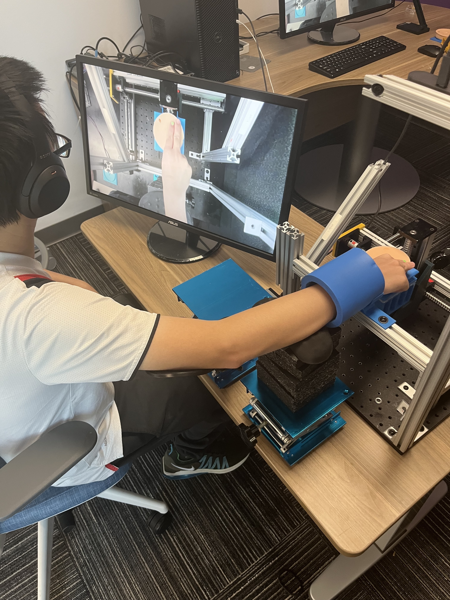

## Demonstration



This work is published in [IEEE Transaction on Haptics](https://doi.org/10.1109/TOH.2024.3523259).

## Project Overview

This testbed enables participants in roles of nurse and doctor to simultaneously feel two identical tissue phantoms. The nurse actively palpates the tissue, while the doctor’s passive hand feels the same sensations by having the phantom move with respect to their hand. We are using this platform to study impacts of embodiment on experience of the doctor, and to observe psychological impacts and communication strategies between doctor and nurse roles.

**🔗 [View Source Code on GitHub](https://github.com/pijuanyu/3D-platform-for-lump-detection)**

### Robotic Platform

 System overview. (b) Top view. (c) Side view.")

The experimental platform that moves the tissue phantom under a passive hand is shown above. We used an XYZ translation stage (FSL40, Fuyu Technology Co., China) composed of three Nema 17 stepper motors (BE069-3, Befenybay) that provide a resolution of 0.011625 mm per step. To address the challenge of motor vibration, the microstepping method was applied, optimizing resolution and dampening vibration noise through the utilization of three stepper motor drivers (DM542T, OMC Corporation Limited, China). These drivers interface with an Arduino Due microcontroller using the AccelStepper package, and the Due communicates with the host computer via Pyserial. The vertical linear stage connects to a support structure with a rubber damper layer incorporated to mitigate remaining vibrations. An ATI Mini 45 force sensor is integrated at the bottom of the tissue phantom to record the force value.

### Trajectory Generation



Positioned above the phantom, a 720p RGB camera (Logitech BRIO webcam, Logitech)serves to capture the finger's movement during the active touch procedure. We limited camera capture to 30 fps, which we deemed adequate to capture the characteristics paths, in order to minimize system computational demands.
In the implementation of hand tracking, the RGB camera serves dual functions: (1) documenting an active palpation exam for future visual feedback and (2) tracking a designated green sticker affixed to the fingernail, thereby capturing finger position during said exam. Utilizing the YUV colorspace tracking algorithm, aided by OpenCV, it surpasses the noise-sensitive RGB color model in stability under varied lighting conditions.

Transitioning from 2D pixel coordinates to 3D world coordinates presents a significant challenge, particularly in the absence of stereo camera data and concomitant depth information. However, given the fixed camera's pose relative to the phantom and the nature of the finger's sliding movement, an alternative method was devised. The conversion from 2D pixel coordinates to 2D world coordinates (in millimeters) was undertaken using intrinsic parameters to rectify pixel coordinate distortions and extrinsic parameters to translate the corrected 2D pixel coordinates. This transformation was calibrated through a standardized process involving an 8x8 printed chessboard as a reference object.

Active palpation of tissue phantoms are recorded with 720p video at a rate of 30 frames per second (FPS). Subsequently, this video is transmitted to the computer and decoded using the aforementioned finger tracking methodology to obtain a waypoint array consisting of approximately 900 data points per 30 seconds of video. From these waypoints, an estimated  raw trajectory is generated through linear interpolation.

In order to provide synchronous visuo-haptic feedback for a pre-recorded video, several primary constraints are observed. Firstly, the purpose of this trajectory is to emulate the haptic feedback correlating to the video's movement; the trajectory is thus pre-determined by the video content, though adaptations or smoothing may be necessary to accommodate hardware capabilities. Secondly, to augment efficiency and preclude delays attributed to computer performance, the playback of the video via OpenCV and the execution of the trajectory are separated. Consequently, the smoothed trajectory must be generated and imported into the microcontroller prior to the video's playback. Thus, the number of data points must be constrained due to the local memory limitations of the microcontroller, which might affect real-time performance. Thirdly, even with limited waypoints for smoothed trajectories, the smoothed trajectory must closely align with the original to synchronize with the video movement without noticeable lag. Finally, the duration of the smoothed trajectory must correspond precisely with the video's duration. After extensive testing of various algorithms, a low pass filter (Gaussian filter, sigma = 8) was chosen to smooth this rough trajectory without discernible lag. 